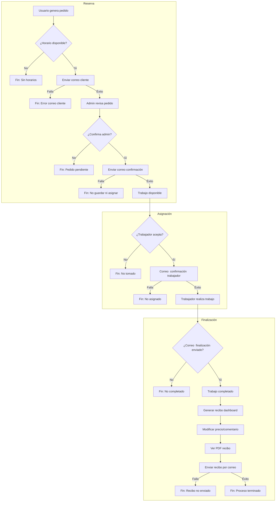

  

# Sistema de Administración de Lavado de Autos

  

  

Aplicación web desarrollada en **Django** para administrar reservas, tarifas, horarios y trabajadores de un servicio de lavado de autos.

  

Incluye un **panel de control moderno** con Bootstrap, envío de correos de confirmación y generación de PDFs con **Html2pdf** y envios automatizados de correos electronicos.

  

  

---

  

  

## Características principales

  

-  **Gestión de reservas** con validación de envío de correo antes de guardar.

  

-  **CRUD personalizado** para modelos: `Reserva`, `Tarifa`, `HorarioDisponible`, `Worker` y `Recibo`.

  

-  **Panel de trabajadores** estilizado con tarjetas, badges y nav-pills de Bootstrap.

  

-  **Generación de PDFs** (facturas y recibos) con xhtml2pdf.

  

-  **Sistema de autenticación** para restringir el acceso a áreas privadas, uso del sistema interno de django(un poco modificado)

  

-  **Envío de correos automáticos** para confirmaciones y cancelaciones.

  

  

---

  

  

## Requisitos previos

  

- Python 3.10+

  

- Django 5.x

  

- Base de datos: PostgreSQL, MySQL o SQLite (por defecto)

  

- pip 

  

- Git 

- Tener una cuenta de google para acceder al smtp de gmail

  

  

---

  

  

## Instalación

  

  

```bash

  

# Clonar el repositorio

  

git  clone  https://github.com/yeivison12/lavado-autos.git

  

cd  lavado-autos

  

  

# Crear entorno virtual

  

python  -m  venv  venv

  

source  venv/bin/activate  # Linux/Mac

  

venv\Scripts\activate  # Windows

  

  

# Instalar dependencias

  

pip  install  -r  requirements.txt

  

  

# Migrar base de datos

  
python manage.py makemigrations

python  manage.py  migrate


# Crear superusuario
python  manage.py  createsuperuser

  
  

# Ejecutar el servidor

  

python  manage.py  runserver

  


```
# Luego debes acceder al panel de administración

debes  crear  un  grupo  llamado  Trabajadores(Con  la  mayúscula) ese  grupo  es  importante  para  el

funcionamiento,  cuando  crees  usuarios,  debes  ponerlos  en  el  grupo

trabajadores  para  que  puedan  acceder  y  limitar  sus  funciones  solo  a  la  de  trabajadores

# Diagrama de flujo

